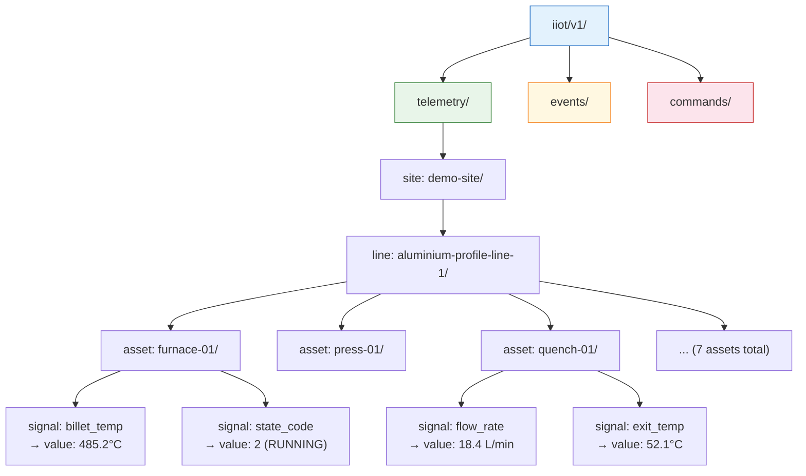
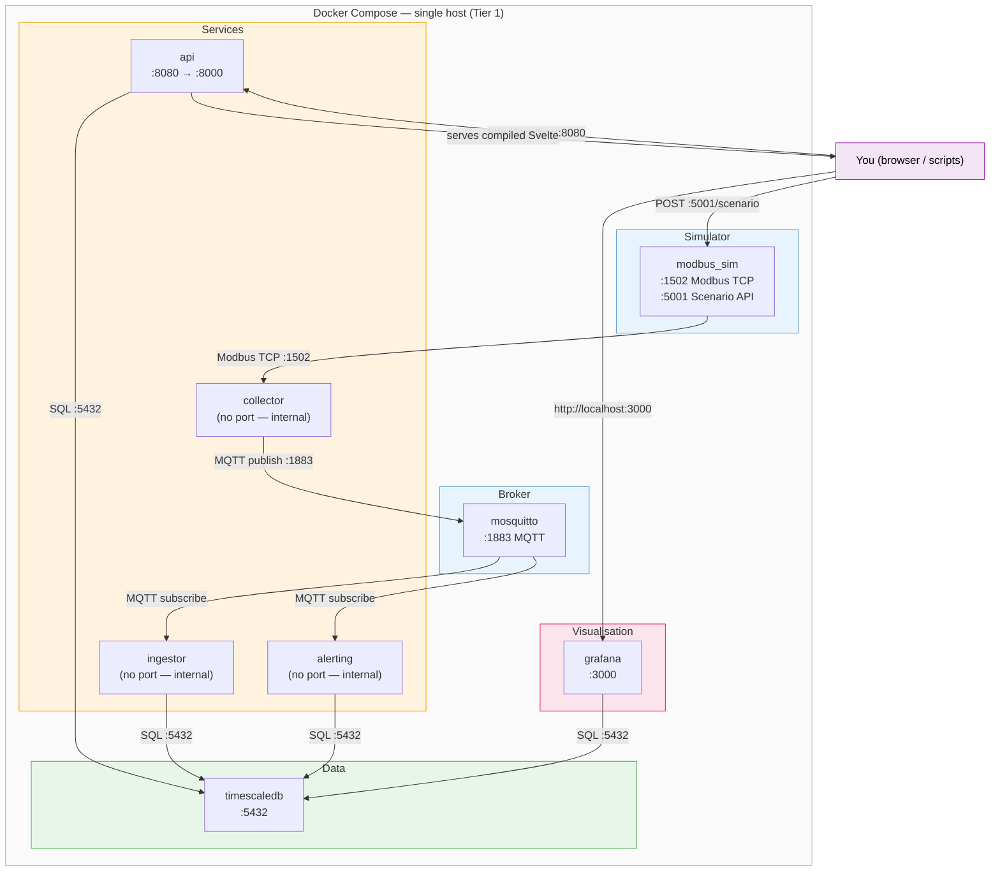

# NEXUS Architecture — Visual Reference

> Three diagrams, each designed to be understood in 30 seconds.
> GitHub renders these natively — no external tool needed.

---

## Diagram 1 — Data Flow

*Factory floor on the left, decision dashboards on the right. Follow the arrows to trace one temperature reading from sensor register to Grafana tile.*

```mermaid
flowchart LR
    subgraph OT["🏭  OT Layer (Shop Floor)"]
        SIM["Modbus TCP Simulator\n7 stations\nport :1502"]
    end

    subgraph EDGE["📡  Edge / Collection"]
        COL["Collector Service\nPolls Modbus every 1 s\nPublishes to MQTT"]
    end

    subgraph MSG["📨  Messaging"]
        MQ["Eclipse Mosquitto\nMQTT broker\nport :1883\nISA-95 topic hierarchy\nACL auth"]
    end

    subgraph PROC["⚙️  Processing (parallel)"]
        ING["Ingestor\nSchema validate\nBatch write → DB"]
        ALT["Alerting Engine\nThreshold → Z-score → ML\nIsolationForest"]
    end

    subgraph STORE["🗄️  Storage"]
        DB["TimescaleDB\nPostgreSQL + hypertables\nport :5432\ntelemetry · alerts · KPIs"]
    end

    subgraph API["🔌  API"]
        FA["FastAPI\nREST + SSE\nport :8080\nX-API-Key auth"]
    end

    subgraph UI["🖥️  Dashboards"]
        SVL["NEXUS Web App\nSvelte 5\nlocalhost:8080"]
        GRF["Grafana\nDecision Board\nlocalhost:3000"]
    end

    SIM -->|"Modbus TCP registers"| COL
    COL -->|"MQTT publish\niiot/v1/telemetry/..."| MQ
    MQ -->|"MQTT subscribe"| ING
    MQ -->|"MQTT subscribe"| ALT
    ING -->|"batch INSERT"| DB
    ALT -->|"INSERT alerts"| DB
    DB -->|"SQL queries"| FA
    DB -->|"direct datasource"| GRF
    FA -->|"REST JSON\nSSE stream"| SVL

    style OT fill:#f5f5f5,stroke:#999
    style EDGE fill:#e8f4fd,stroke:#5b9bd5
    style MSG fill:#e8f4fd,stroke:#5b9bd5
    style PROC fill:#fff3e0,stroke:#f0a500
    style STORE fill:#e8f5e9,stroke:#4caf50
    style API fill:#fce4ec,stroke:#e91e63
    style UI fill:#f3e5f5,stroke:#9c27b0
```

---

## Diagram 2 — ISA-95 MQTT Topic Hierarchy

*Every message in the system has a structured topic address — like a postal code for factory data. This is the ISA-95 standard. It makes multi-site aggregation, security ACLs, and data routing trivial.*

> **Why this matters:** A subscriber can listen to `iiot/v1/telemetry/#` to get all data, or `iiot/v1/telemetry/site-b/+/quench-01/#` to watch only quench stations on one site. No code change — MQTT topic wildcards handle the filtering.

---

## Diagram 3 — Container Topology

*Eight Docker containers orchestrated by Docker Compose. Arrows show who calls whom. Numbers are the host-side ports you open in a browser or connect to.*

### Port reference

| Port | Service | What you do with it |
|---|---|---|
| **3000** | Grafana | Open in browser → decision board |
| **8080** | NEXUS web app + FastAPI | Open in browser → ops UI; also Swagger at `/docs` |
| **5001** | Scenario API | `.bat` scripts POST to this to inject faults |
| **1502** | Modbus TCP | Collector reads from this (internal, not user-facing) |
| **1883** | MQTT / Mosquitto | Internal messaging (subscribe with MQTT Explorer to debug) |
| **5432** | TimescaleDB | Connect with DBeaver/psql for DB inspection (`iiot`/`iiot_password_change_me`) |

---

*For the full text-based architecture description: [`../architecture.md`](../architecture.md)*
*For technology choice rationale: [`../adr/`](../adr/)*
