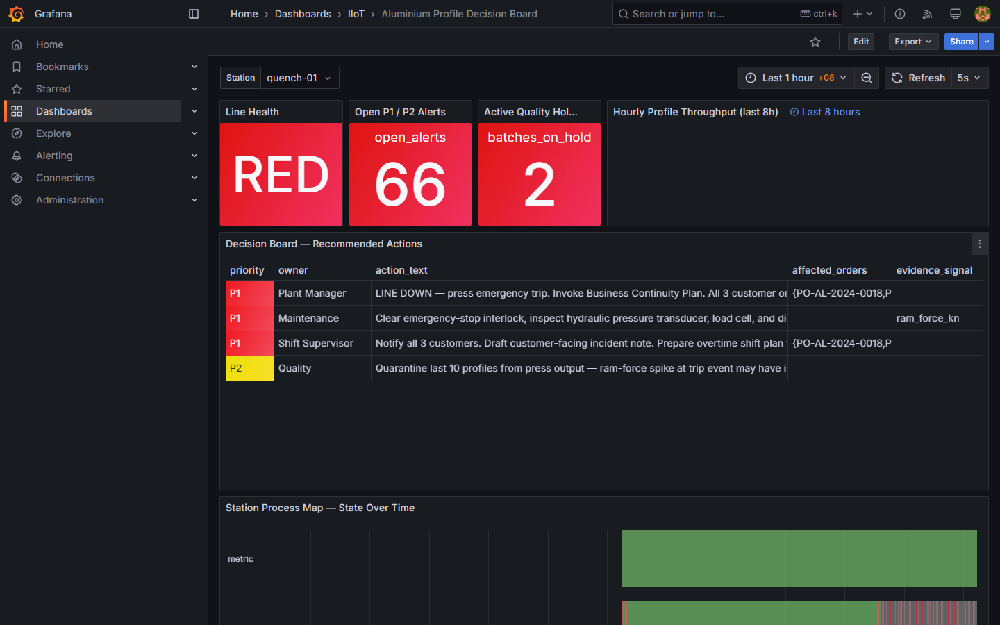
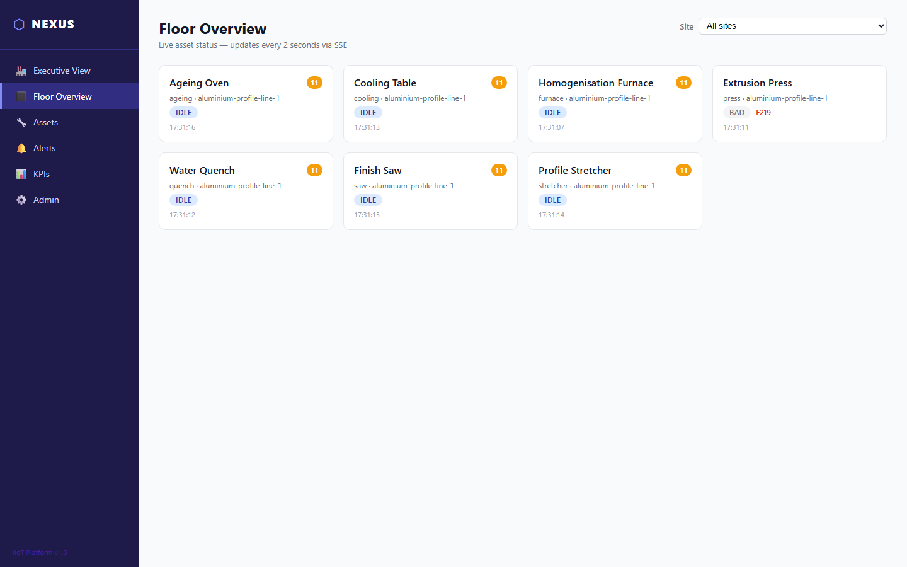
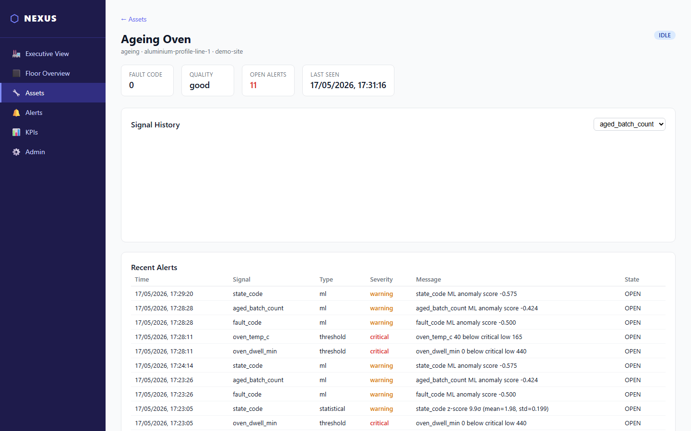
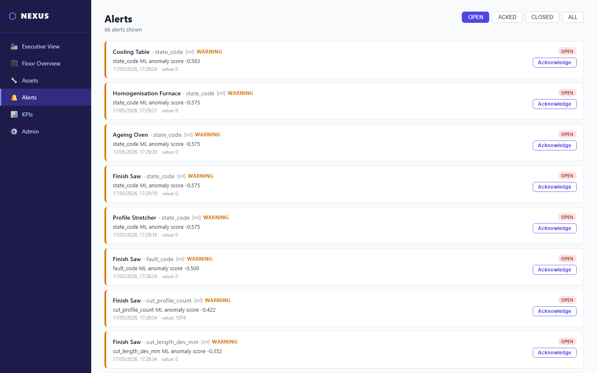
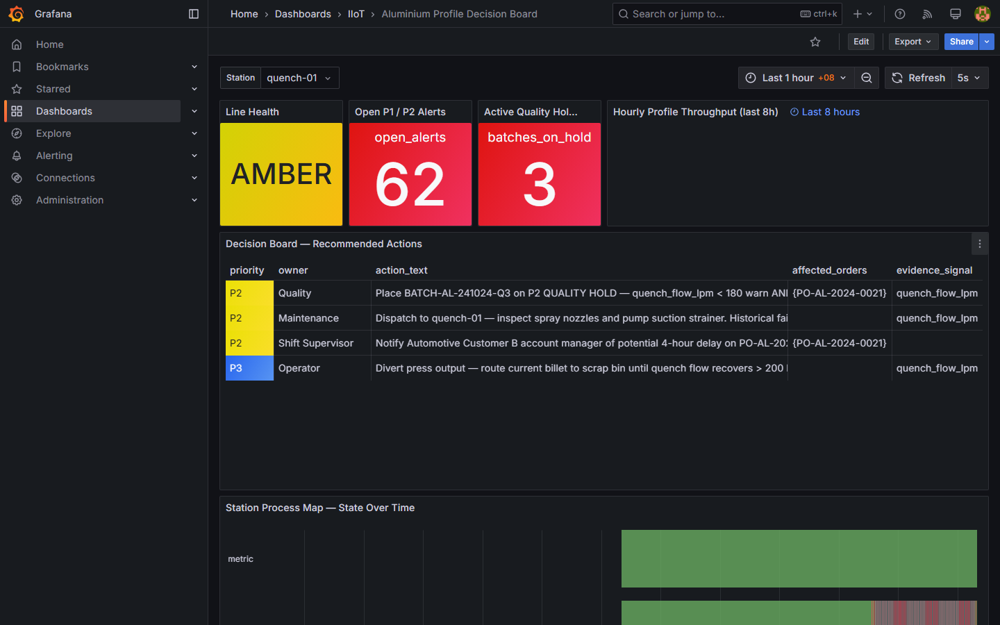

# NEXUS — Windows Demo Walkthrough

> **For non-technical viewers, internal teammates, and recruiters reviewing this portfolio.**
> Goal: get a live aluminium-extrusion factory demo running on your Windows laptop in under 10 minutes, with three mouse clicks.

---

## TL;DR

| Step | Do this | You'll see |
|---|---|---|
| 1 | Double-click `scripts\start-demo.bat` | Grafana + web UI open in your browser, factory data streaming live |
| 2 | Double-click `scripts\scenario-quench-fault.bat` | Decision board flips to AMBER, "Quench flow below spec" alert fires |
| 3 | Double-click `scripts\stop-demo.bat` | Everything shuts down cleanly (your data is kept for next time) |

> **No coding required.** Everything runs in Docker containers on your machine — nothing is uploaded, nothing touches the cloud.

---

## Prerequisites

Tick each item before you start. **All of these are free.**

- [ ] **Windows 10 / 11**, 64-bit
- [ ] **Docker Desktop ≥ 4.x** installed and running ([download](https://www.docker.com/products/docker-desktop/))
- [ ] **WSL 2** enabled (Docker Desktop installer handles this on first run)
- [ ] **~8 GB free RAM** while the demo is running (close Chrome tabs if needed)
- [ ] **~3 GB free disk** for container images (first run only — re-runs are instant)
- [ ] **These ports free** on your machine: `1502`, `1883`, `3000`, `5001`, `5432`, `8080`
  - If you've never run Postgres / Grafana / Mosquitto locally, you're fine
  - To check: open PowerShell → `Get-NetTCPConnection -LocalPort 3000` (no output = port free)
- [ ] **The repo cloned locally** — `git clone https://github.com/SaladinIART/salbotics-iiot-aluminium-demo.git` (or download the ZIP from GitHub → "Code" → "Download ZIP")

> **First time?** Open Docker Desktop and wait for the whale icon in your system tray to stop bouncing. That means the engine is ready.

---

## Run the demo (three clicks)

1. **Start the stack**
   Open the repo folder in Windows Explorer → go into `docs\windows-demo\scripts\` → **double-click `start-demo.bat`**.
   A black PowerShell-style window will appear, build the containers (~3 min the first time, ~15 s after), then automatically open two browser tabs:
   - `http://localhost:3000` — Grafana (login: `admin` / `change_me_now`)
   - `http://localhost:8080` — NEXUS web app (Svelte)

2. **Watch it work**
   Both tabs show **live** data flowing from a simulated 7-station aluminium extrusion line. No setup, no sample CSV — actual Modbus messages running through MQTT, into TimescaleDB, out via REST API and Server-Sent Events.

3. **Stop when done**
   Double-click `stop-demo.bat`. Containers stop; the database volume is kept, so next start is fast and your alert history is still there. Use `reset-demo.bat` (asks you to confirm) only if you want a fresh slate.

---

## What you'll see — 5 screens

> *Screenshots in [`./screenshots/`](./screenshots/) — captured on a 1440p Windows laptop, Edge browser.*

### 1. Grafana — Aluminium Profile Decision Board
**URL:** `http://localhost:3000` → dashboard list → *Aluminium Profile Decision Board*
A management-facing single-page board. Top banner shows line health (GREEN / AMBER / CRITICAL). Tiles show the 7 stations: furnace, press, quench, cooling, stretcher, saw, ageing. Each tile has a state colour and a one-line message a plant manager can read in 2 seconds.

[](./screenshots/01-grafana-decision-board.png)

### 2. NEXUS Web App — Executive Dashboard
**URL:** `http://localhost:8080` → sidebar → *Executive View → Dashboard*
The same data, framed for an operations director: scenario banner across the top ("Automotive Customer B order at risk"), a list of recommended actions, and an interactive floor-map showing which station is causing the trouble.

[](./screenshots/02-svelte-dashboard.png)

### 3. Asset Browser
**URL:** `http://localhost:8080/assets`
Drill into any station to see its raw signals (temperature, flow, vibration, state) plotted over the last hour. This is what an OT engineer would use to validate a sensor or chase a transient fault.

[](./screenshots/03-asset-list.png)

### 4. Alert Inbox
**URL:** `http://localhost:8080/alerts`
Every alert produced by the 3-layer engine (threshold → statistical baseline → ML anomaly) lands here. Click an alert to see its source signal trace, then acknowledge it. Acknowledgements are POSTed to the API and stored in TimescaleDB.

[](./screenshots/04-alerts-panel.png)

### 5. Live Fault Scenario — Quench Hold
After you double-click `scenario-quench-fault.bat`, watch both tabs for ~10 seconds. The decision board flips to AMBER, the quench tile turns red with `QUENCH_FLOW_LOW`, the executive scenario banner says "Quench flow below spec with rising exit temperature — P2 quality hold on in-box profiles". The alert appears in the inbox without a page refresh (it streams in via Server-Sent Events).

[](./screenshots/05-quench-fault-active.png)

---

## Trigger a fault (and other scenarios)

The simulator ships with six demo scenarios. Each is one double-click:

| Script | Scenario name | What it demonstrates |
|---|---|---|
| `scenario-quench-fault.bat` | `QUALITY_HOLD_QUENCH` | **Flagship.** Quench flow drops, exit temperature rises, T5/T6 temper at risk. AMBER. |
| `scenario-reset.bat` | `NORMAL` | Return everything to green. |

The other scenarios (press bottleneck, stretcher backlog, ageing oven deviation, emergency press trip) can be triggered by editing the `.bat` to change the `scenario` name, or by `curl` directly:

```powershell
curl.exe -X POST http://localhost:5001/scenario -H "Content-Type: application/json" -d '{\"scenario\": \"EMERGENCY_PRESS_TRIP\"}'
```

Scenarios auto-reset to `NORMAL` after 10 minutes, so a forgotten demo won't sit in a fault state forever.

---

## FAQ — by recruiter angle

Tags: **[MES]** = manufacturing IT / ERP-adjacent · **[OT]** = IIoT / shop-floor / PLC · **[PLAT]** = full-stack / platform / DevOps

**Q. Is this real factory data?**  *[MES] [OT]*
No — it's a Modbus TCP simulator emulating a real 7-station aluminium extrusion line (furnace → press → quench → cooling → stretcher → saw → ageing). The shape of the data, the register map, and the fault behaviour all mirror equipment I worked with at Alumac Industries (17-machine power monitoring rollout). The protocol layer is identical to production; the *equipment* is the simulated part.

**Q. Could this connect to a real PLC tomorrow?**  *[OT]*
Yes. The collector talks raw Modbus TCP to whatever responds on the host:port in `.env`. Swap `MODBUS_HOST=modbus_sim` for the IP of an actual Schneider / Siemens / Allen-Bradley gateway, update the register map in `contracts/`, restart — no code change needed.

**Q. Why MQTT instead of OPC-UA?**  *[OT] [MES]*
MQTT is the lightest-weight pub/sub that almost every modern broker speaks. OPC-UA is the formal standard for the ISA-95 stack but it's heavy and the licensing story is messy on the cloud side. MQTT + ISA-95 topic hierarchy (`iiot/v1/telemetry/{site}/{line}/{asset}/{signal}`) gives you 80% of the OPC-UA discoverability with 20% of the operational pain. See [ADR-004](../adr/004-isa95-topic-hierarchy.md).

**Q. Why TimescaleDB and not InfluxDB?**  *[MES] [PLAT]*
Three reasons: (1) it's PostgreSQL underneath, so I can JOIN telemetry to a `shifts` or `assets` table without exporting CSVs; (2) at high cardinality it's ~3.5× faster than Influx on the queries this project actually needs; (3) one operational toolchain — backup, replication, monitoring — instead of two. Full reasoning in [ADR-001](../adr/001-timescaledb-over-influxdb.md).

**Q. Why Svelte instead of React?**  *[PLAT]*
Smaller bundle, no virtual DOM overhead for a dashboard that updates every 2 s via SSE, and the team here is one engineer — Svelte's compiler-first approach means less framework knowledge to keep current. See [ADR-002](../adr/002-fastapi-svelte-frontend.md).

**Q. How does the alerting work?**  *[MES] [OT]*
Three layers, each catches what the other misses:
1. **Threshold rules** in a SQL table (`alert_rules`) — fast, explainable, what a plant manager would write.
2. **Statistical baseline** — z-score over the last 100 samples; catches drift the threshold misses.
3. **ML anomaly** — IsolationForest, retrained every 500 samples; catches weird patterns no human wrote a rule for.
All three feed the same `alerts` table and the same UI. See [ADR-003](../adr/003-alert-three-layer.md).

**Q. How would this scale beyond one site?**  *[PLAT] [MES]*
Three deployment tiers with **no code rewrites** — only config:
- Tier 1 (now): `docker compose up` — single host, < 10 devices
- Tier 2: multi-site Compose overlay + MQTT bridge — 10-100 devices, 1-3 sites
- Tier 3: Helm chart on Kubernetes + EMQX cluster — 100+ devices, multi-site

**Q. Is the code production-ready?**  *[PLAT]*
It's *demo-ready* and *architecturally* production-shaped: typed Python (FastAPI + pydantic), schema-validated MQTT, hypertable DB with proper indexes, CI on every push, ADRs for every non-obvious choice. To go production you'd want: real secrets management (Vault/AWS Secrets), TLS on MQTT, a proper identity layer in front of the API, and load tests at target volume. None of those are large lifts — they're listed because they're missing, not because the design blocks them.

**Q. Who built this?**  *[All]*
One engineer (me — Salbotics Solutions, Penang) during a career transition window, Sept 2025 → Apr 2026. The point of the project is to show end-to-end ownership: I can sit on the PLC side **or** the SAP/MES side **or** the platform side of a project and not need a different person for each layer.

---

## Troubleshooting

| Symptom | Fix |
|---|---|
| `start-demo.bat` window closes immediately | Right-click the .bat → **Run as administrator**, or open PowerShell, `cd` to the scripts folder, run `.\start-demo.bat` so you can read any error message. |
| "Docker daemon is not running" | Open Docker Desktop, wait for the whale icon to go solid, then re-run `start-demo.bat`. |
| "WSL 2 installation is incomplete" | Run `wsl --install` in an admin PowerShell, reboot, re-open Docker Desktop. |
| Browser opens to "site can't be reached" | Containers may still be starting on the first run. Wait 60 s, refresh. If still failing: `docker compose ps` in PowerShell — every service should say `running` (or `healthy`). |
| Port already in use error | Something else is using 3000 / 8080 / 1883 / 5432. Find it with `Get-NetTCPConnection -LocalPort 3000` in PowerShell and stop that process, or edit `docker-compose.yml` to remap the host-side port. |
| Grafana login fails | Default is `admin` / `change_me_now`. If you changed it via `.env`, use that. To reset: `reset-demo.bat`. |
| First build takes forever | Normal — Docker pulls ~2 GB of base images on first run. Subsequent starts use the cache. Grab a coffee. |
| Decision board shows no data after fault scenario | Check the alerting container is up: `docker compose logs alerting --tail 50`. If it's restarting, see runbook [03-alert-tuning.md](../runbooks/03-alert-tuning.md). |

---

## Where to next

- **Want the 5-minute live-demo script** (word-for-word talking points for a recruiter call)? → [`DEMO_SCRIPT_5MIN.md`](./DEMO_SCRIPT_5MIN.md)
- **Want the architecture in pictures** (mermaid diagrams of data flow + ISA-95 + containers)? → [`ARCHITECTURE_DIAGRAM.md`](./ARCHITECTURE_DIAGRAM.md)
- **Want the engineering deep-dive**? → [`../architecture.md`](../architecture.md), the four [ADRs](../adr/), and the five [runbooks](../runbooks/)
- **Want to extend it** with a real PLC or a new asset? → [`../runbooks/02-adding-new-asset.md`](../runbooks/02-adding-new-asset.md)

---

*Built by Salbotics Solutions, Penang — [github.com/SaladinIART/salbotics-iiot-aluminium-demo](https://github.com/SaladinIART/salbotics-iiot-aluminium-demo)*
